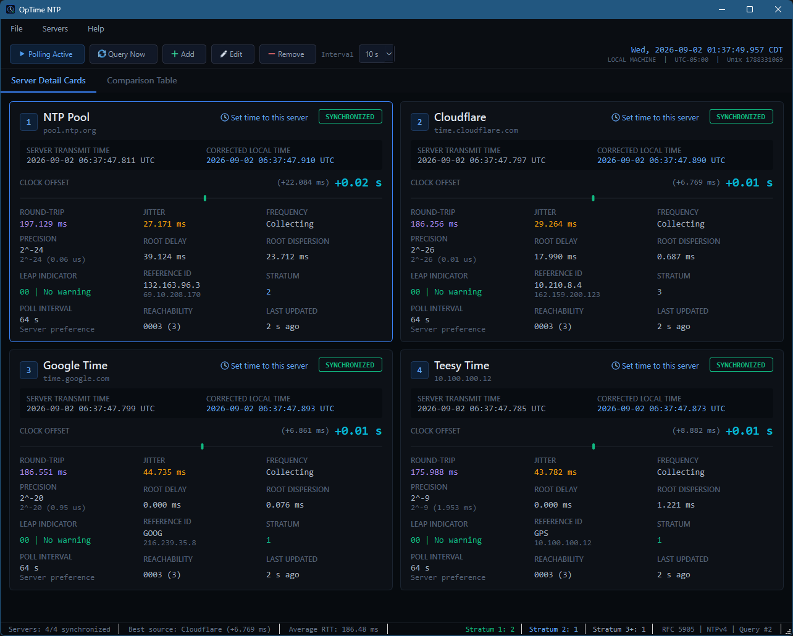
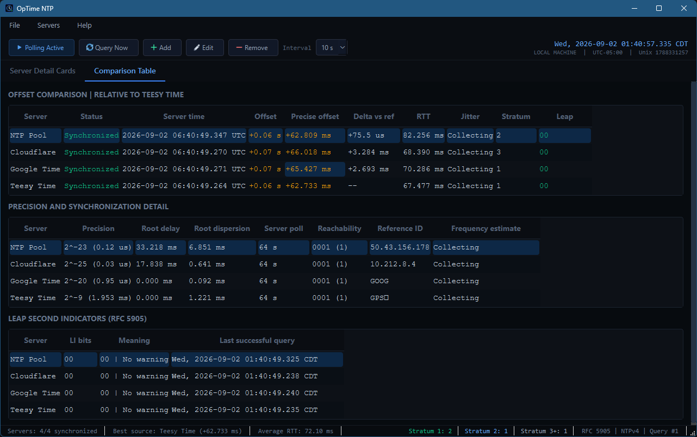

# OpTime NTP

OpTime NTP is a native C++20 and Qt 6.10.3 desktop application that compares
the local computer clock with up to ten NTPv4 servers. It implements the
standard four-timestamp clock-offset and round-trip-delay calculations. A
user-confirmed action on each server card can apply a fresh server correction
to the local machine clock.

The interface is based on an instrument-panel presentation,
server detail cards, comparison tables, polling controls, timing metrics, and
status summary while replacing all mock data with asynchronous UDP queries.

| Server Detail Cards | Comparison Table |
| :---: | :---: |
|  |  |

## Supported Targets

- Windows 11 x64 with Visual Studio 2026 and the v145 MSVC toolset
  (primary development and test target)
- Linux x64 and ARM64 with GCC
- macOS ARM64 with Apple Clang

The CMake project requires CMake 3.25 or newer and declares policy
compatibility through CMake 4.3. Windows builds require CMake 4.2 or newer for
the Visual Studio 18 2026 generator. The project is intended for CLion 2026.2.1.

## Windows Build

Qt is expected at `C:\Development\Qt\6.10.3\msvc2022_64` by default. The Qt
kit retains that directory name and is binary-compatible with the Visual Studio
2026 v145 toolset. Override `CMAKE_PREFIX_PATH` when Qt is installed elsewhere.

```powershell
cmake -S . -B cmake-build-debug-visualstudio-2026 `
  -G "Visual Studio 18 2026" -A x64 -T "v145,host=x64" `
  -DOPTIME_DEPLOY_QT_RUNTIME=ON
cmake --build cmake-build-debug-visualstudio-2026 --config Debug
ctest --test-dir cmake-build-debug-visualstudio-2026 -C Debug --output-on-failure
```

CLion uses its `VisualStudio` toolchain pointed at Visual Studio 2026, bundled
CMake 4.3.1, and the explicit Visual Studio 18 2026 generator with v145.
`CMakePresets.json` also defines Windows Debug/Release, Linux x64 Release, and
macOS ARM64 Release configurations. Platform archive scripts are documented in
`packaging/README.md`.

## Use

The first run configures four servers from the Figma prototype:

- `pool.ntp.org`
- `time.cloudflare.com`
- `time.google.com`
- `time.windows.com`

Use **Add**, **Edit**, and **Remove** to manage one to ten servers. **Query
Now** sends an NTP request to every idle server. Polling can run every 2, 5, 10,
30, or 60 seconds. Settings and window geometry are stored with `QSettings`.

Use **File > Save Server List As...** to export the configured display names
and server addresses to YAML. Use **File > Load Server List...** to validate
and replace the current list with a saved file. Loading supports one to ten
unique servers, asks for confirmation before replacing the current list, and
immediately queries the imported servers. The portable file does not contain
runtime samples, internal IDs, polling settings, or window settings.

The versioned YAML format is:

```yaml
format: OpTimeNTP
version: 1
servers:
  - label: NTP Pool
    host: pool.ntp.org
  - label: Cloudflare
    host: time.cloudflare.com
```

Each server card includes a flat **Set time to this server** action. OpTime NTP
cancels overlapping requests, obtains a fresh synchronized response from that
server, and displays the measured correction and estimated resulting local time
for confirmation. It first uses the application's existing privileges. If more
privilege is required, Windows uses a UAC prompt, Linux uses PolicyKit through
`pkexec`, and macOS uses the standard administrator authorization dialog. A
successful clock change clears measurements made against the old clock and
queries every server again. Linux systems must provide `pkexec` and a working
PolicyKit authentication agent for elevation. The footer reports live counts
of displayed Stratum 1, Stratum 2, and Stratum 3+ server samples.

UDP port 123 must be permitted by the local firewall and network. A timeout
does not necessarily indicate an application defect; many managed networks
block outbound NTP traffic.

## Timing Data

The prominent offset is always rendered as signed hundredths of a second, as
required, while an adjacent value retains microsecond or millisecond detail.
Jitter and frequency drift are estimates based on the most recent eight
successful samples. Frequency drift displays **Collecting** until those samples
span at least one minute.

## Licensing

OpTime NTP is MIT licensed. The NTP implementation was informed by the
MIT-licensed `elrinor/qntp` project. YAML parsing and emission use the
MIT-licensed `yaml-cpp` library. See `THIRD_PARTY_NOTICES.md` for notices.
